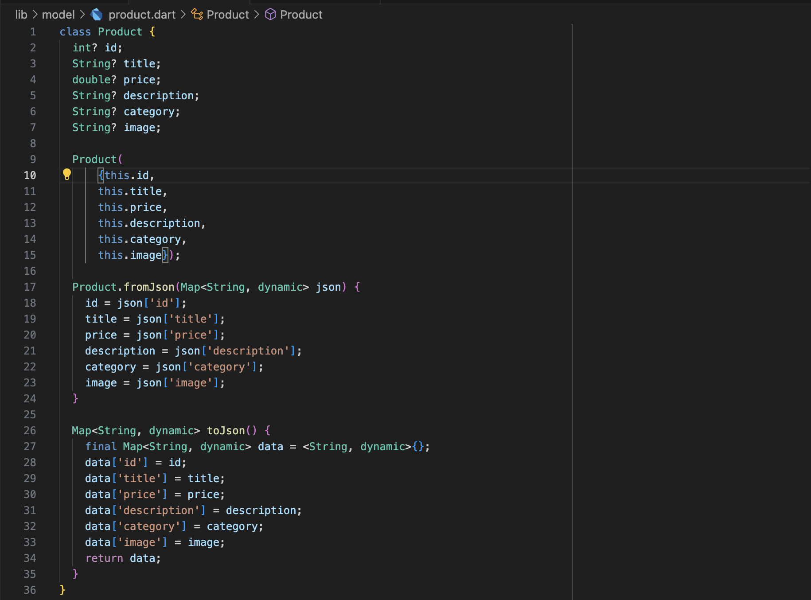
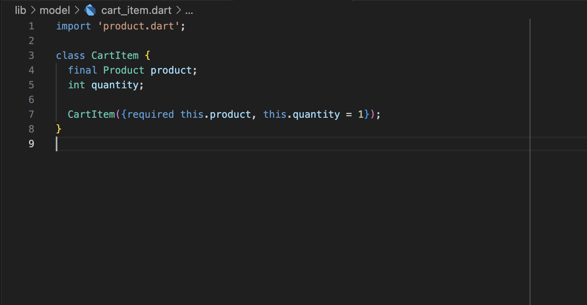
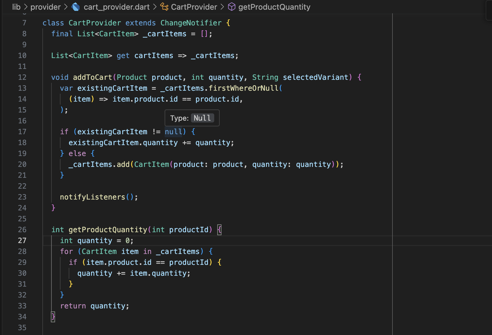
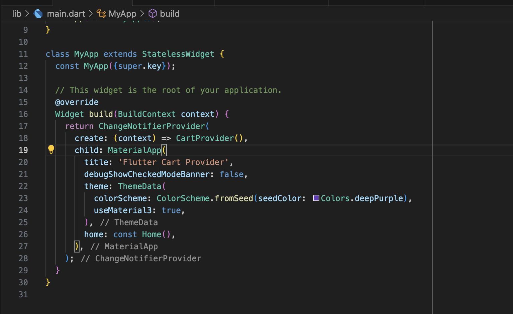

## Building a Flutter Shopping Cart with Provider Step-by-Step Guide

## Introduction:

In the world of mobile app development, creating a shopping cart is a fundamental feature for e-commerce applications. Flutter, with its rich ecosystem of packages, provides an excellent framework for building robust and user-friendly shopping carts. In this step-by-step guide, we'll walk you through the process of implementing a shopping cart system in Flutter using the Provider package.
To make it even more realistic, we'll fetch sample products from the [FakeStoreAPI](https://fakestoreapi.com/products) to populate your shopping cart and showcase its functionality.


### Prerequisites:

Before we get started, make sure you have the following prerequisites in place:

- Flutter installed on your system.
- A basic understanding of Flutter widgets and app structure.
- A code editor like Visual Studio Code or Android Studio.

### Step 1: Set Up Your Flutter Project

Let's begin by creating a new Flutter project. Open your terminal and run the following commands:

```bash
flutter create flutter_cart_provider
```

```bash
cd flutter_cart_provider
```

### Step 2: Add Dependencies

In this step, we need to add both the http package for making API requests and the provider package for state management.

```bash
flutter pub add http
```

```bash
 flutter pub add provider
```

### Step 3: Create Models

In this step, we'll create two models: Product and CartItem. These models will represent the products you're selling and the items in the shopping cart. Create a new directory called models and add these two Dart files.




- create an HttpService class that works with your Product

### Step 4: Create a Cart Provider

Now, we'll create a cart provider class that will manage our shopping cart state.

- Create a new Dart file called cart_provider.dart:
- Update the main.dart file with ChangeNotifierProvider




### Step 5: Display Products and Implement Add to Cart Functionality

In your widget where you display the products, you can now implement the "Add to Cart" functionality. This involves using the Provider package to update the cart state.

```bash
 Provider.of<CartProvider>(context, listen: false)
                        .addToCart(product, 1, "");
```

### Step 6: Display the Shopping Cart

Create a new widget to display the shopping cart. You can use a ListView or any other widget to display the cart items. Make sure to listen to changes in the cart using the Consumer widget from the Provider package.

### Step 7: Testing and Debugging

Test your shopping cart thoroughly. Check if items are added correctly, if quantities update as expected, and if the total price is calculated accurately.

- Checkout my blog [https://samsonude.dev/blog](https://samsonude.dev/blog) here.
